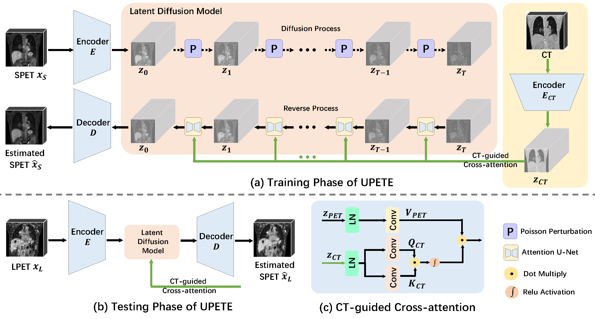

# PET-diffusion: Unsupervised PET Enhancement based on the Latent Diffusion Model

This repository contains the code of our paper "PET-diffusion: Unsupervised PET Enhancement based on the Latent Diffusion Model"
(see https://link.springer.com/chapter/10.1007/978-3-031-43907-0_1).



## System requirements
This software was originally designed and run on a system running Ubuntu.

## Environment setup

Create a virtual environment 
```
conda create -n PET-diffusion python=3.8
``` 
and activate it with 
```
conda activate PET-diffusion
```
Install other dependencies
```
pip install -r requirements.txt
```


# Training

First, train the three-dimensional autoencoder model:

```
python train_autoencoder.py dataset=brats dataset.root_dir=<INSERT_PATH_TO_DATASET> model=autoencoder model.gpus=1 model.default_root_dir_postfix='flair' 
```

To train the diffusion model in the latent space of the previously trained autoencoder model:
```
python train_ddpm.py model=ddpm dataset=brats model.results_folder_postfix='flair' model.autoencoder_ckpt=<INSERT_PATH_TO_CHECKPOINT> 
```


# Citation
```
@inproceedings{jiang2023pet,
  title={PET-Diffusion: Unsupervised PET Enhancement Based on the Latent Diffusion Model},
  author={Jiang, Caiwen and Pan, Yongsheng and Liu, Mianxin and Ma, Lei and Zhang, Xiao and Liu, Jiameng and Xiong, Xiaosong and Shen, Dinggang},
  booktitle={International Conference on Medical Image Computing and Computer-Assisted Intervention},
  pages={3--12},
  year={2023},
  organization={Springer}
}
```


# Acknowledgement
This repository makes liberal use of code from: 

(1) https://github.com/SongweiGe/TATS

(2) https://github.com/lucidrains/denoising-diffusion-pytorch

(3) https://github.com/lucidrains/video-diffusion-pytorch
